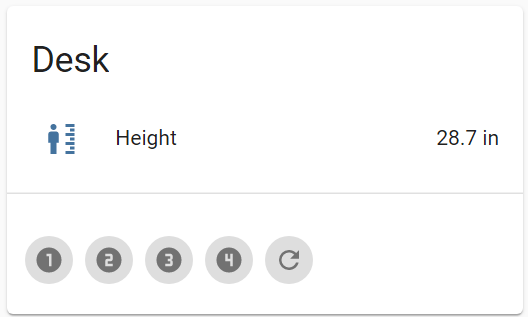

# laing-controller

> Connects Laing Innotech motorized desks to automation by MQTT.

laing-controller is a service that connects to a Laing Innotech desk motor controller using modbus over RS485. This is PC software intended to be run from a computer attached to the desk. You'll need hardware for this.

TODO: document how to wire an FTDI USB-RS485 with RJ-25 connectors.

## Warning

This can be dangerous. Do not put things where they can get in the way of the desk moving. Do not operate the desk unattended. Consider the security aspects of making motorized equipment accessible over the network.

## Compatible controllers

The only controller confirmed to be compatible is the LTC302-US-00-00-G0.

## Configuration and topics

See the file laing-controller.yaml.

## Home Assistant

If you are using [Home Assistant] and have [MQTT discovery] enabled (enabled by default when you configure MQTT), entities will be automatically created within Home Assistant.

- binary_sensor.NAME_connected - ON when the program is running and connected to MQTT
- button.NAME_1 - press to go to preset 1
- button.NAME_2 - press to go to preset 2
- button.NAME_3 - press to go to preset 3
- button.NAME_4 - press to go to preset 4
- button.NAME_refresh - press to refresh the height (useful if the physical buttons have been used)
- sensor.NAME_height - the current height of the desk (in inches)

Where NAME is replaced by the name specified in the configuration file.

You can use the following card configuration to make it appear in Lovelace:



```yaml
type: buttons
entities:
  - entity: button.NAME_1
    tap_action:
      action: call-service
      service: button.press
      service_data:
        entity_id: button.NAME_1
  - entity: button.NAME_2
    tap_action:
      action: call-service
      service: button.press
      service_data:
        entity_id: button.NAME_2
  - entity: button.NAME_3
    tap_action:
      action: call-service
      service: button.press
      service_data:
        entity_id: button.NAME_3
  - entity: button.NAME_4
    tap_action:
      action: call-service
      service: button.press
      service_data:
        entity_id: button.NAME_4
  - entity: button.NAME_refresh
    tap_action:
      action: call-service
      service: button.press
      service_data:
        entity_id: button.NAME_refresh
```

[Home Assistant]: https://www.home-assistant.io/
[MQTT discovery]: https://www.home-assistant.io/docs/mqtt/discovery/
